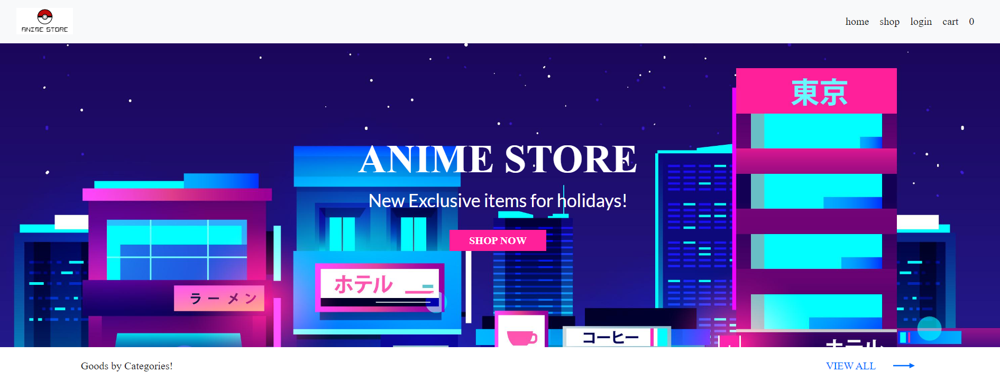
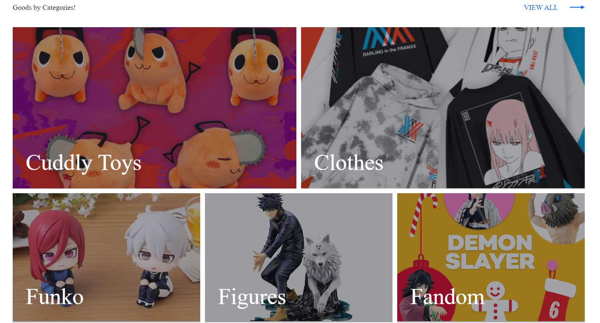
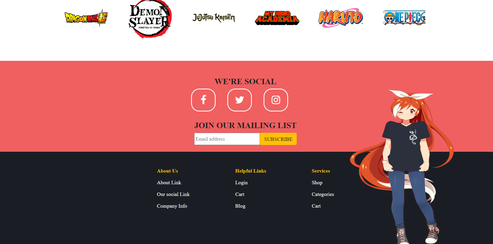
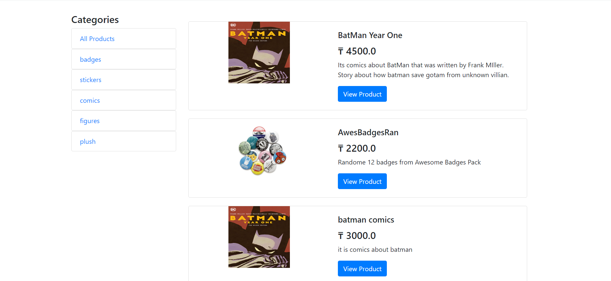
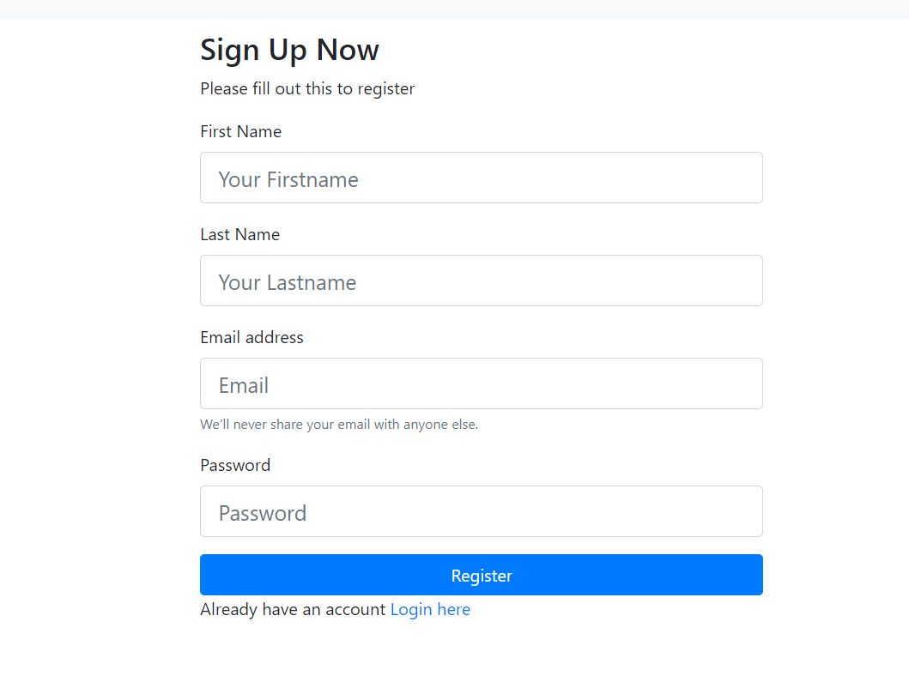
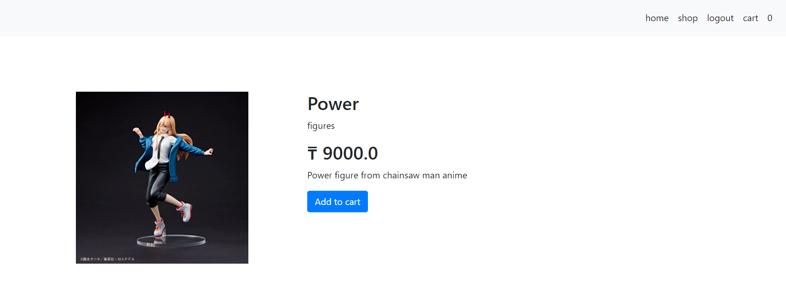
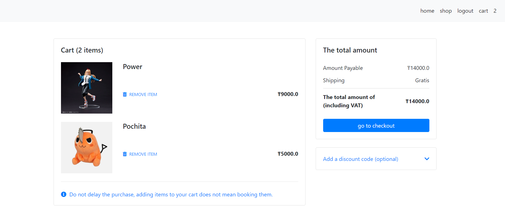
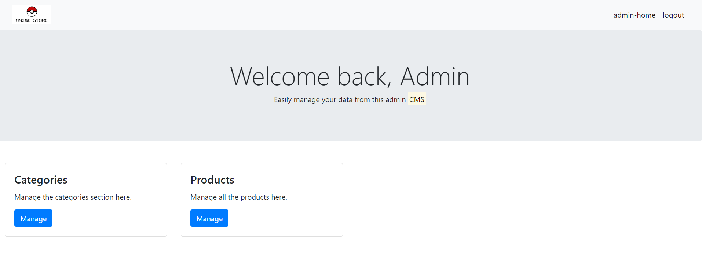
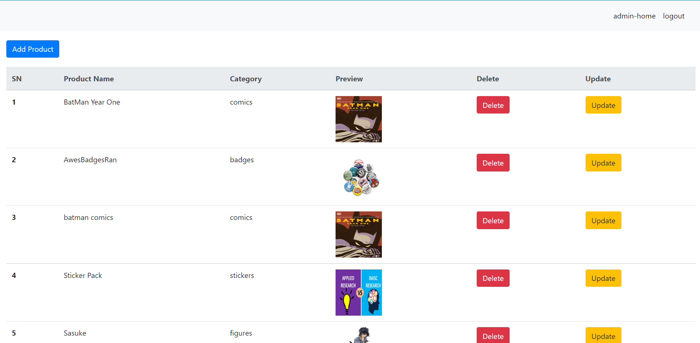

# Anime Shop website

### Using such technologies as Java, Spring Framework, MVC, HTML/CSS, JS, bootstrap etc.

It's a website where people can see products related with anime and other games, movies. And sort that products, make an order etc.

 
### Products divided into few categories

### User can sort product by category

### Registration and Login
 

### Then Add product to the cart

## See products from their cart and make order

## Also, Admin Panel where he can do all CRUD operations with tables and data

